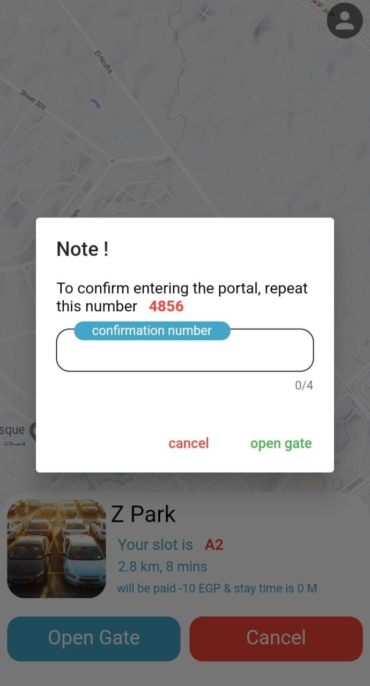

# smart_parking

- It is the last project that I created, which was a graduation project for one of the students.  
- An idea that the user registers with and knows the nearest private garage in which the car can be parked, the price of the hour, the vacant spaces in the garage, and the ability to open the gate from the program. There are illustrative pictures in detail.  

# Some Screenshots

- intor & create account & login 
<!-- || -->
 

 
 
                    
- When registering for the first time, the phone number is verified
 

- Home page You can choose from any garage
 

                    

- After choosing the garage, choose the vacant place

                    
 
- Choose from a previously registered credit card or add a new one

                    
 
- After that, you can open the doors upon arrival, and to make sure of the wrong pressure limit, write the existing code and when you exit as well

                   
 
- And in the end, you get the bill

